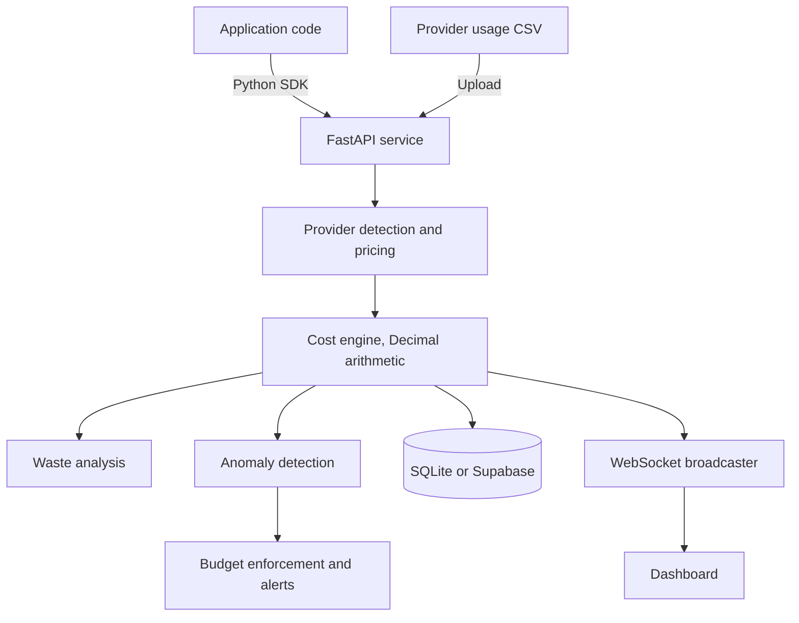

# Substacker

Substacker attributes large language model spend to the teams, projects, and models
that caused it. It ingests provider usage exports or live SDK traffic, applies
per-model token pricing, and reports where the money went, which spend was
avoidable, and when a workload starts burning budget faster than it should.

It covers OpenAI, Anthropic, Google Gemini, and Azure OpenAI, including the current
GPT-5, Claude 5, and Gemini 3 families alongside retired models so historical exports
still price correctly. It runs as a single FastAPI service backed by either a
zero-configuration SQLite database or Supabase.

[](https://github.com/Vmnebula/substacker/actions/workflows/ci.yml)
[](LICENSE)
[](pyproject.toml)


## Contents

- [Why](#why)
- [Quick start](#quick-start)
- [Importing usage data](#importing-usage-data)
- [Tracking live traffic with the SDK](#tracking-live-traffic-with-the-sdk)
- [Configuration](#configuration)
- [HTTP API](#http-api)
- [Architecture](#architecture)
- [Development](#development)
- [Project layout](#project-layout)
- [Contributing](#contributing)
- [Security](#security)
- [License](#license)

## Why

Provider billing dashboards report a single number for an entire organisation. They
cannot answer the question that matters after the invoice arrives: which team, which
service, and which model produced the spend.

Substacker answers that by attributing every request to a team and a model, and by
reporting three things on top of the raw totals:

- **Attribution.** Cost per team, model, and project, from CSV exports or live traffic.
- **Waste analysis.** Duplicate prompts, oversized system prompts, and requests routed
  to a more expensive model than the workload requires.
- **Anomaly detection.** Velocity checks that flag runaway agent loops before they
  land on the next invoice.

## Quick start

Requires Python 3.10 or newer.

```bash
git clone https://github.com/Vmnebula/substacker.git
cd substacker

python3 -m venv venv
source venv/bin/activate
pip install -r requirements.txt

cp .env.example .env
python3 -c "import secrets; print('SECRET_KEY=' + secrets.token_hex(32))" >> .env

uvicorn app:app --reload
```

Open <http://localhost:8000>. The default configuration writes to a local SQLite file
and needs no external services. A hosted instance runs at
<https://substacker.vmnebula.com>.

## Importing usage data

Substacker reads a CSV with one row per model invocation:

```csv
model,prompt_tokens,completion_tokens,team
gpt-5,150,250,marketing
claude-opus-5,200,300,data_science
gemini-3.7-flash,80,120,marketing
azure-gpt-4o,90,180,engineering
```

The provider is inferred from the model name, so a single file can mix providers.
Upload it from the analyzer page, or post it directly:

```bash
curl -X POST http://localhost:8000/analyze -F "file=@usage.csv"
```

A starter file is available at `GET /api/csv-template`, and sample datasets live in
`sample_data/`.

Models that are not in the pricing table are recorded with a cost of zero and flagged
in the response rather than silently priced wrong. Pricing lives in `cost_analyzer.py`,
was last verified against provider pricing pages on 2026-08-18, and uses `Decimal`
arithmetic throughout so repeated aggregation does not drift. List prices only: batch
and cached-input discounts are not modelled, so a real invoice is usually lower.

## Tracking live traffic with the SDK

The Python SDK wraps an existing OpenAI client and reports usage after each call.
Generate an API key from the admin dashboard, then:

```python
from openai import OpenAI

from substacker_sdk import track_openai

client = track_openai(
    OpenAI(),
    api_key="sk_substacker_...",
    team="engineering",
    endpoint="http://localhost:8000/api/track",
)

# Use the client exactly as before. Usage is reported in the background.
response = client.chat.completions.create(
    model="gpt-5",
    messages=[{"role": "user", "content": "Summarise this incident report."}],
)
```

Token counts come from the provider response when present, and fall back to a
`tiktoken` estimate otherwise. Install the SDK on its own with
`pip install ./substacker_sdk`.

## Configuration

Configuration is read from the environment, or from a `.env` file in the project root.
Copy `.env.example` to get started.

| Variable | Default | Description |
| --- | --- | --- |
| `SECRET_KEY` | none | Required. Signs session cookies and tokens. Use at least 32 random characters. |
| `DATABASE_TYPE` | `sqlite` | Storage backend. `sqlite` needs no setup; `supabase` requires the two variables below. |
| `SUPABASE_URL` | none | Project URL, required when `DATABASE_TYPE=supabase`. |
| `SUPABASE_KEY` | none | Service key, required when `DATABASE_TYPE=supabase`. |
| `BASE_URL` | `http://localhost:8000` | Public URL used in generated links and emails. |
| `ENVIRONMENT` | `development` | Set to `production` to enable stricter cookie and CSRF handling. |
| `JWT_EXPIRATION` | `3600` | Session lifetime in seconds. |
| `MAX_FILE_SIZE` | `10485760` | Largest accepted upload, in bytes. |
| `MAX_FILE_ROWS` | `10000` | Largest accepted row count per upload. |
| `SMTP_HOST`, `SMTP_PORT`, `SMTP_USER`, `SMTP_PASS` | none | Optional. Email delivery for reports and alerts; disabled when unset. |

Provider API keys (`OPENAI_API_KEY`, `ANTHROPIC_API_KEY`, and the rest) are only needed
if you pull usage from a provider directly. CSV import and SDK tracking do not require them.

## HTTP API

| Method | Path | Auth | Description |
| --- | --- | --- | --- |
| `GET` | `/health` | none | Service and database health. |
| `POST` | `/analyze` | none | Upload a usage CSV and receive a cost and waste breakdown. |
| `GET` | `/api/csv-template` | none | Download a template CSV. |
| `POST` | `/api/track` | API key | Record a single model invocation. Used by the SDK. |
| `GET` | `/api/costs/by-team` | API key | Cost totals grouped by team. |
| `GET` | `/api/dashboard/realtime` | API key | Current totals and recent activity. |
| `GET` | `/export/csv` | session | Export stored analysis results. |
| `WS` | `/ws` | API key | Live cost and token stream. |

Interactive documentation is served at `/docs` when the application is running.
Uploads are rate limited to 10 per minute and tracking calls to 1000 per minute.

## Architecture



## Development

```bash
pip install -r requirements.txt
pip install pytest pytest-cov ruff

pytest                 # test suite
ruff check .           # lint
```

Lint and tests run on every push and pull request across Python 3.10 through 3.13,
alongside a check that the application boots with the default configuration. Rules are
configured in `pyproject.toml`.

## Project layout

```
app.py                       FastAPI application, routes, and startup wiring
cost_analyzer.py             Pricing tables, model matching, Decimal cost arithmetic
analyzer_multi_provider.py   Higher-level multi-provider reporting over cost_analyzer
anomaly_detector.py          Spend velocity and spike detection
budget_enforcer.py           Per-team budget limits and policy checks
auth.py, security.py         Sessions, API key issuance, and input validation
database.py                  SQLite backend
database_supabase.py         Supabase backend
email_service.py             Report and alert delivery
websocket_manager.py         Connection registry and event broadcasting
substacker_sdk/              Python client library
templates/, static/          Server-rendered dashboard
tests/                       Test suite
sample_data/                 Example CSV files
docs/                        Documentation, see docs/README.md
```

## Contributing

Bug reports, provider adapters, and SDK ports are all welcome. See
[CONTRIBUTING.md](CONTRIBUTING.md) for the development workflow and
[CODE_OF_CONDUCT.md](CODE_OF_CONDUCT.md) for community expectations.

## Security

Report vulnerabilities privately through the repository's Security tab rather than as a
public issue. See [SECURITY.md](SECURITY.md).

## License

MIT. See [LICENSE](LICENSE).
