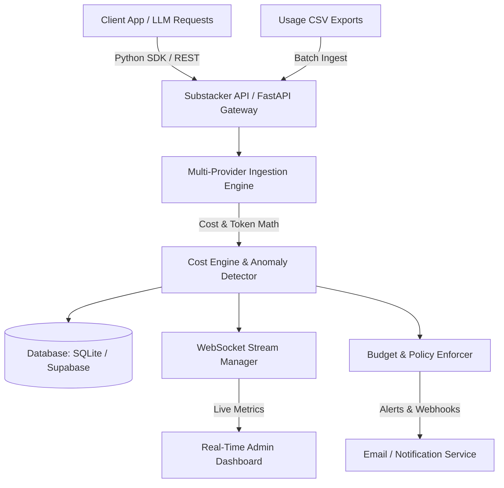

# Substacker — Open Source AI Cost Intelligence & FinOps Platform

[](https://www.gnu.org/licenses/gpl-3.0)
[](https://www.python.org/downloads/)
[](https://fastapi.tiangolo.com)
[](CONTRIBUTING.md)

> **"Your AI bill is $47,000. Who spent it?"**  
> Substacker is a high-throughput, multi-tenant AI cost attribution engine and observability platform. It ingests token-level spend across OpenAI, Anthropic, Google Vertex/Gemini, and Azure OpenAI, attributing costs directly to teams, models, environments, and projects in real time.

---

## 🎬 Product Demo


---

## 🏛️ System Architecture



---

## ✨ Key Features

- 🎯 **Team-Level Cost Attribution:** Map AI token usage and costs directly to departments (Engineering, Growth, Data, Product).
- 🔌 **Universal Multi-Provider Support:** Native cost models and parsers for:
  - **OpenAI** (GPT-4o, GPT-4 Turbo, GPT-3.5, Embeddings)
  - **Anthropic** (Claude 3.5 Sonnet, Claude 3 Opus, Haiku)
  - **Google Gemini** (Gemini 1.5 Pro, Flash, Vertex AI)
  - **Azure OpenAI**
- 🐍 **Lightweight Python SDK:** Drop-in context manager and decorators to track live API calls without adding request latency.
- ⚡ **Real-Time Observability:** WebSockets push live token throughput and financial burn directly to an analytics dashboard.
- 🛡️ **Budget Enforcement & Anomaly Detection:** Real-time velocity monitoring flags runaway agent loops and spikes before bills explode.
- 🗄️ **Dual Database Layer:** Seamlessly switches between local zero-config SQLite and scalable cloud Supabase (PostgreSQL).

---

## 📁 Repository Structure

```
├── app.py                      # FastAPI core application & API gateway
├── analyzer_multi_provider.py  # Multi-provider cost engine wrapper
├── analyzer_v2.py              # Decimal-precision token & pricing math
├── anomaly_detector.py         # Anomaly detection for token burn spikes
├── budget_enforcer.py          # Real-time team budget limits & policies
├── websocket_manager.py        # Real-time WebSocket connection manager
├── substacker_sdk/             # Python client library for applications
├── docs/                       # Architecture diagrams, specifications, assets
│   ├── architecture/           # Data flows and network diagrams
│   └── assets/                 # Product demo GIF & UI illustrations
├── sample_data/                # Sample CSV datasets for testing imports
├── tests/                      # Pytest automated test suite
└── templates/                  # Frontend UI templates
```

---

## 🚀 Quickstart

### 1. Prerequisites
- Python 3.10+
- `pip` or `uv`

### 2. Installation & Setup

```bash
git clone https://github.com/Vmnebula/substacker.git
cd substacker

# Create virtual environment
python3 -m venv venv
source venv/bin/activate

# Install dependencies
pip install -r requirements.txt
```

### 3. Configure Environment

Copy the example environment file and set your `SECRET_KEY`:

```bash
cp .env.example .env
```

Generate a secure secret key:
```bash
python3 -c "import secrets; print('SECRET_KEY=' + secrets.token_hex(32))" >> .env
```

### 4. Run Locally

```bash
uvicorn app:app --host 0.0.0.0 --port 8000 --reload
```

Visit the dashboard at `http://localhost:8000`.

---

## 🧪 Running Tests

Substacker includes test coverage for multi-provider cost calculations, API key verification, and security middleware:

```bash
pytest
```

---

## 📦 Using the Python SDK

Track LLM invocations in your own applications:

```python
from substacker_sdk import SubstackerClient

client = SubstackerClient(
    api_key="***",
    endpoint="http://localhost:8000"
)

# Track an LLM interaction
client.track_usage(
    provider="openai",
    model="gpt-4o",
    team="engineering",
    prompt_tokens=1250,
    completion_tokens=320,
    cost=0.0157,
    project="autonomous-agent-v2"
)
```

---

## 🤝 Contributing

We welcome contributions from the developer and FinOps community!

1. Fork the Project
2. Create your Feature Branch (`git checkout -b feature/AmazingFeature`)
3. Commit your Changes (`git commit -m 'Add some AmazingFeature'`)
4. Push to the Branch (`git push origin feature/AmazingFeature`)
5. Open a Pull Request

See [CONTRIBUTING.md](CONTRIBUTING.md) for complete guidelines.

---

## 📄 License

Distributed under the **GNU General Public License v3.0 (GPLv3)**. See [`LICENSE`](LICENSE) for more information.
